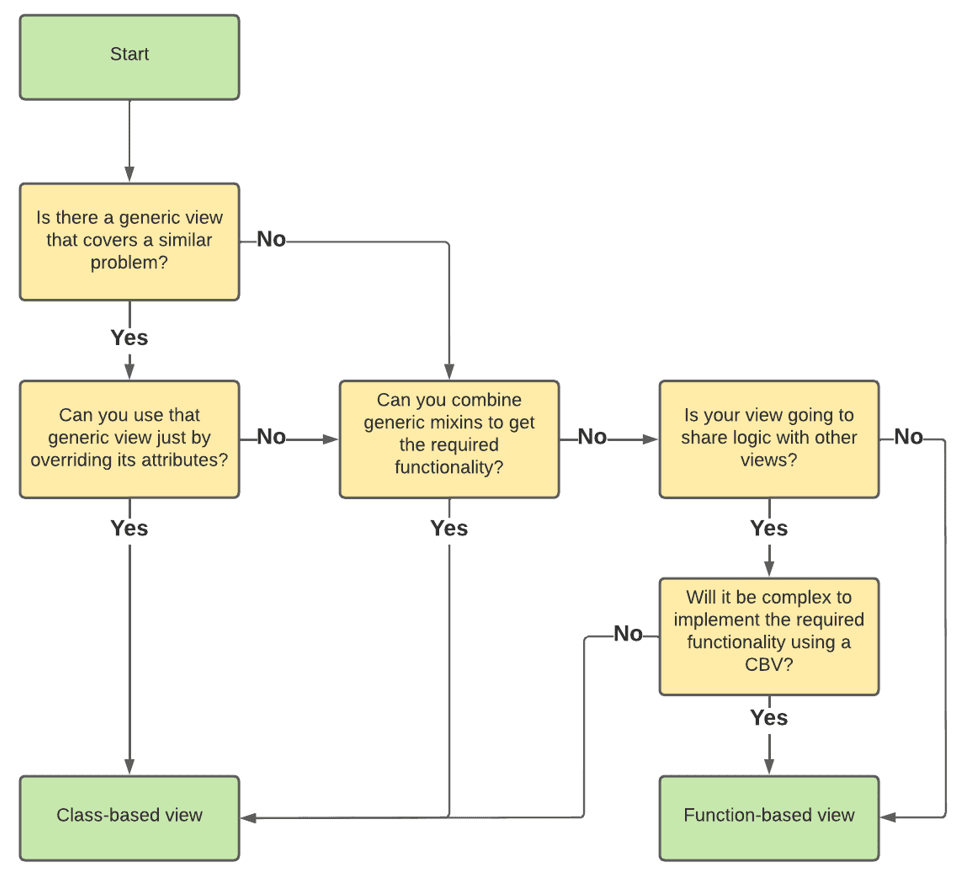

- [QR](#org16065f3)
- [Принцип DRY](#org4a90cd4)
- [Функции высшего порядка](#orgb5d3180)
- [Декораторы](#orgb363a0d)
- [Декораторы в Django](#orgaeeb420)
- [Function Based View](#org9e97854)
- [Class Based View](#org996d5d9)
- [Generic Based View](#org518ad31)
- [Схема выбора](#orge319bc9)
- [Дополнительная литература](#org72a3960)


<a id="org16065f3"></a>

# QR

  


<a id="org4a90cd4"></a>

# Принцип DRY

-   **D:** on't  
    *не*
-   **R:** epeat  
    *повторяй*
-   **Y:** ourself  
    *-ся*


<a id="orgb5d3180"></a>

# Функции высшего порядка

[Функции, принимающие на вход другие функции или возвращающие функцию в качестве результата](https://ru.wikipedia.org/wiki/%D0%A4%D1%83%D0%BD%D0%BA%D1%86%D0%B8%D1%8F_%D0%B2%D1%8B%D1%81%D1%88%D0%B5%D0%B3%D0%BE_%D0%BF%D0%BE%D1%80%D1%8F%D0%B4%D0%BA%D0%B0)  

```python
def f(data, func):
    return [func(e) for e in data]

print(f([1, 2, 3], lambda x: x*2))
```

    - [2, 4, 6]

```python
def f(x):
    def w(y):
        return x + y
    return w
plus_10 = f(10)
print(plus_10(1))
print(plus_10(113))
```

    - 11
    - 123


<a id="orgb363a0d"></a>

# Декораторы

```python
#
# Callable[[Args], Result]
#
C = Callable[[Any], Any]
Callable[[C], C]
```


<a id="orgaeeb420"></a>

# Декораторы в Django

<https://docs.djangoproject.com/en/4.2/topics/http/decorators/>  


<a id="org9e97854"></a>

# Function Based View

```python
# Function Based Views
from django.shortcuts import render, get_object_or_404, redirect

from .forms import TaskForm, ConfirmForm
from .models import Task


def task_list_view(request):
    return render(request, 'todo/task_list.html', {
        'tasks': Task.objects.all(),
    })


def task_create_view(request):
    if request.method == 'POST':
        form = TaskForm(data=request.POST)
        if form.is_valid():
            task = form.save()
            return redirect('task-detail', pk=task.pk)

    return render(request, 'todo/task_create.html', {
        'form': TaskForm(),
    })


def task_detail_view(request, pk):
    task = get_object_or_404(Task, pk=pk)

    return render(request, 'todo/task_detail.html', {
        'task': task,
    })


def task_update_view(request, pk):
    task = get_object_or_404(Task, pk=pk)

    if request.method == 'POST':
        form = TaskForm(instance=task, data=request.POST)
        if form.is_valid():
            form.save()
            return redirect('task-detail', pk=task.pk)

    return render(request, 'todo/task_update.html', {
        'task': task,
        'form': TaskForm(instance=task),
    })


def task_delete_view(request, pk):
    task = get_object_or_404(Task, pk=pk)

    if request.method == 'POST':
        form = ConfirmForm(data=request.POST)
        if form.is_valid():
            task.delete()
            return redirect('task-list')

    return render(request, 'todo/task_confirm_delete.html', {
        'task': task,
        'form': ConfirmForm(),
    })
```


<a id="org996d5d9"></a>

# Class Based View

```python
# Class Based Viwes
from django.shortcuts import render, get_object_or_404, redirect
from django.views import View

from .forms import TaskForm, ConfirmForm
from .models import Task


class TaskListView(View):

    def get(self, request, *args, **kwargs):
        return render(request, 'todo/task_list.html', {
            'tasks': Task.objects.all(),
        })


class TaskCreateView(View):

    def get(self, request, *args, **kwargs):
        return render(request, 'todo/task_create.html', {
            'form': TaskForm(),
        })

    def post(self, request, *args, **kwargs):
        form = TaskForm(data=request.POST)
        if form.is_valid():
            task = form.save()
            return redirect('task-detail', pk=task.pk)

        return self.get(request)


class TaskDetailView(View):

    def get(self, request, pk, *args, **kwargs):
        task = get_object_or_404(Task, pk=pk)

        return render(request, 'todo/task_detail.html', {
            'task': task,
        })


class TaskUpdateView(View):

    def get(self, request, pk, *args, **kwargs):
        task = get_object_or_404(Task, pk=pk)
        return render(request, 'todo/task_update.html', {
            'task': task,
            'form': TaskForm(instance=task),
        })

    def post(self, request, pk, *args, **kwargs):
        task = get_object_or_404(Task, pk=pk)
        form = TaskForm(instance=task, data=request.POST)
        if form.is_valid():
            form.save()
            return redirect('task-detail', pk=task.pk)

        return self.get(request, pk)


class TaskDeleteView(View):

    def get(self, request, pk, *args, **kwargs):
        task = get_object_or_404(Task, pk=pk)
        return render(request, 'todo/task_confirm_delete.html', {
            'task': task,
            'form': ConfirmForm(),
        })

    def post(self, request, pk, *args, **kwargs):
        task = get_object_or_404(Task, pk=pk)
        form = ConfirmForm(data=request.POST)
        if form.is_valid():
            task.delete()
            return redirect('task-list')

        return self.get(request, pk)
```


<a id="org518ad31"></a>

# Generic Based View

```python
# Generic Based Views
from django.views.generic import ListView, DetailView, DeleteView, UpdateView, CreateView

from .models import Task


class TaskListView(ListView):
    model = Task
    context_object_name = 'tasks'


class TaskCreateView(CreateView):
    model = Task
    context_object_name = 'task'
    fields = ('name', 'description', 'is_done')
    template_name = 'todo/task_create.html'


class TaskDetailView(DetailView):
    model = Task
    context_object_name = 'task'


class TaskUpdateView(UpdateView):
    model = Task
    context_object_name = 'task'
    fields = ('name', 'description', 'is_done')
    template_name = 'todo/task_update.html'


class TaskDeleteView(DeleteView):
    model = Task
    context_object_name = 'task'
    success_url = '/'
```


<a id="orge319bc9"></a>

# Схема выбора

  


<a id="org72a3960"></a>

# Дополнительная литература

-   <span class="underline"><span class="underline">[Python Design Patterns](https://python-patterns.guide/)</span></span>
-   <span class="underline"><span class="underline">[Blog](https://testdriven.io/blog/django-class-based-vs-function-based-views/)</span></span>
-   <span class="underline"><span class="underline">[Перевод](https://django.fun/ru/articles/tutorials/class-based-vs-function-based-views-in-django/)</span></span>
-   <span class="underline"><span class="underline">[Mixins](https://django.fun/ru/docs/django/4.0/topics/class-based-views/mixins/)</span></span>
